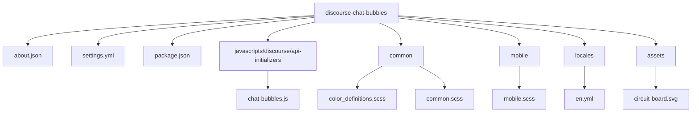

# discourse-chat-bubbles

## 项目定位
- 这是一个 Discourse 主题组件（theme component），目标是把移动端聊天界面调整为类似气泡风格，并支持可配置颜色与背景纹理。
- 主要价值在于视觉呈现改造，不引入后端业务逻辑或数据库模型。

## 初始化信息
- 初始化时间: 2026-02-22T01:39:37+08:00
- 初始化策略: 根级简明 + 模块级详尽
- 增量更新策略: 重跑 `/init-project` 时优先比较模块关键入口与配置文件变更，再按模块增量刷新本索引和局部 CLAUDE 文档。

## 架构总览
- 技术栈: Discourse Theme Component, JavaScript API Initializer, SCSS, YAML 配置与文案。
- 运行形态: 由 Discourse 主题系统加载 `about.json` 与资源文件；样式以 `common/` 与 `mobile/` 为主。
- 对外行为: 通过样式和主题设置（`settings.yml`）影响聊天界面的颜色、背景与消息布局。

## 仓库结构图

## 模块索引
| 模块 | 路径 | 职责 | 关键文件 | 模块文档 |
|---|---|---|---|---|
| 元数据与组件声明 | `.` | 声明主题组件、资源映射与包级依赖 | `about.json`, `package.json` | 本文件 |
| 前端初始化器 | `javascripts/discourse/api-initializers` | 挂载 Discourse 前端 API 初始化逻辑 | `chat-bubbles.js` | `javascripts/discourse/api-initializers/CLAUDE.md` |
| 通用样式与颜色变量 | `common` | 定义颜色函数、变量与跨端公共样式基座 | `color_definitions.scss`, `common.scss` | `common/CLAUDE.md` |
| 移动端气泡样式 | `mobile` | 主体聊天气泡样式与布局覆盖 | `mobile.scss` | `mobile/CLAUDE.md` |
| 国际化文案 | `locales` | 主题元数据文案 | `en.yml` | `locales/CLAUDE.md` |
| 静态资源 | `assets` | 背景纹理等资源文件 | `circuit-board.svg` | `assets/CLAUDE.md` |

## 全局规范
- 不修改 Discourse 核心代码，仅通过主题组件机制扩展。
- 新增视觉配置时，优先在 `settings.yml` 声明并在 SCSS 中消费。
- 样式命名与层级遵循现有聊天 DOM 结构（`.chat-*` 命名族）。
- JS 初始化逻辑应保持轻量、幂等，避免重复挂载副作用。

## 质量工具与工作流
- JavaScript Lint: 继承 `eslint-config-discourse`（见 `.eslintrc`, `package.json`）。
- Template Lint: `ember-template-lint-plugin-discourse` + `discourse:recommended`（见 `.template-lintrc.js`）。
- 依赖锁定: `yarn.lock`。
- 当前仓库未发现独立 CI 流水线、单元测试目录或后端测试脚手架；依赖宿主 Discourse 环境进行集成验证。

## 覆盖率与缺口
- 已扫描文件数 / 估算总文件数: `10 / 10`（初始化扫描时，未含本次新增 CLAUDE 文档）。
- 已覆盖模块占比: `6 / 6`（100%）。
- 忽略/跳过原因:
  - 生成物与二进制大文件默认不做深读（例如 `assets/circuit-board.svg` 仅做索引，不做像素级分析）。
- 主要缺口:
  - 未检出自动化测试文件，测试策略需要在宿主 Discourse 站点中以手工回归或端到端方式补足。

## 建议下一步深挖路径
- `mobile/mobile.scss`：按消息类型（普通、收藏、线程）拆分样式段并补充约束说明。
- `common/color_definitions.scss`：补充变量到设置项的映射表，降低维护成本。
- `javascripts/discourse/api-initializers/chat-bubbles.js`：确认注释代码是否仍有保留价值，必要时清理并补文档。
